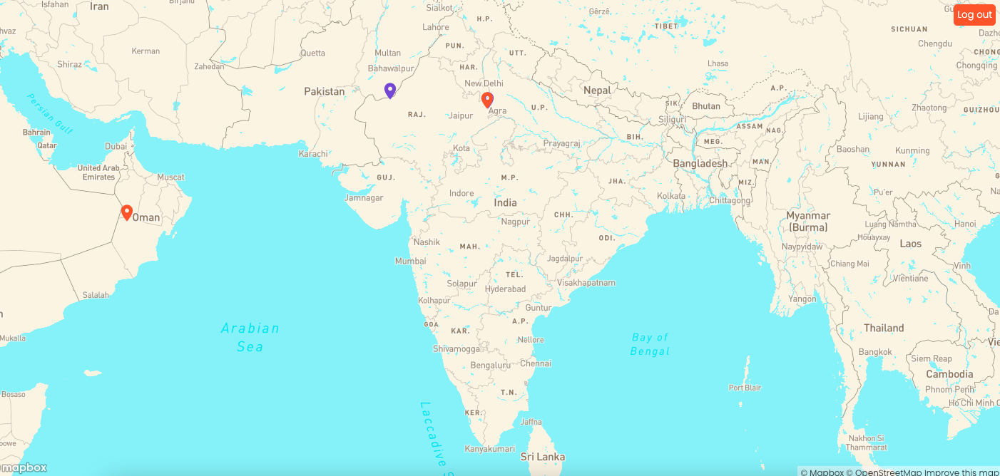
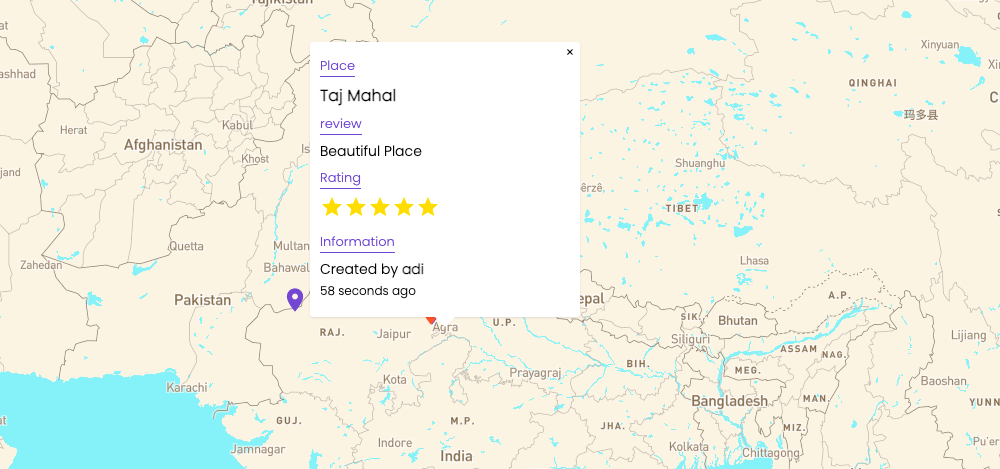
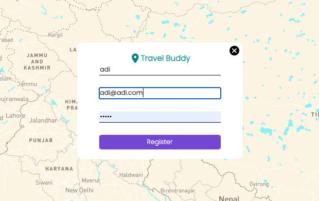
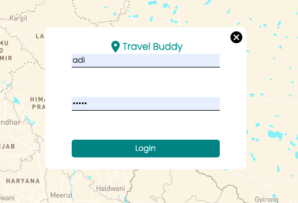

# Travel Buddy

This is a web-app to read and post experiences at tourist places online. You can register and login to add pins to new places. 
Pins from the current users are shown in orange and those from other users are shown in blue. 
Double click at any point in the map to add a new pin. Click on a pin to view description and rating. 

## Frontend

Frontend is bootstrapped using Reactjs. 
The main page consists of a full-screen map, and buttons according to user's login status. Single click on a pin opens a pop-up with description and rating. We use axios to connect frontend to backend.

## Backend

Backend is build using Node.js and Expressjs. It uses the port 8800. Information about user or pins can be posted and fetched in the database. 

## Database

MongoDB is used as a database. 

## Preview: 






# Set-up

* Clone this repository using ```git clone https://github.com/aditee-singh/TravelBuddy.git
* Start frontend with: ```yarn start
* View frontend at: ```http:localhost:3000
* Start backend with: ```yarn start
* View backend at: ```http:localhost:8800
* Replace MongoDB url with your own username and password, navigate to clusters on your mongoDB profile.

You are good to go. Happy Hacking!